# Nama Aplikasi App - Flutter Application

<div align="center">
<url>
  
  </div>
<div align="center">
Institut Teknologi dan Bisnis Bina Sarana Global <br>
FAKULTAS TEKNOLOGI INFORMASI & KOMUNIKASI 
<br>
https://global.ac.id/
  </div>

  ##  Project UAS
  - Mata Kuliah : Aplikasi Mobile
  - Kelas : TI SE 23 M
  - Semester : GANJIL 
  - Tahun Akademik: 2025 - 2026 
  
  

## About The Project

Nekomind adalah aplikasi mobile modern yang dikembangkan menggunakan Flutter untuk membantu user mencatat ide ide brilian mereka yang menyediakan antarmuka yang intuitif, fitur sinkronisasi cloud menggunakan firebase authentication , dan firebase store

Dengan fitur pencatatan dengan tampilan minimalis yang nikmat dipandang mata, fitur notifikasi pengingat untuk catatan, dan aplikasi yang sudah terintegrasi dengan akun google masing masing, serta fitur hapus yang masuk ke 'sampah' (Trash) dengan sistem delete otomatis setelah 7 hari, dan lain lain.

### Key Features

- **Modern UI/UX Design** - Antarmuka yang clean, minimalis, dan user-friendly
- **Google Integration** - Login mudah dan sinkronisasi dengan Akun Google
- **Pin Notes** - Sematkan catatan penting agar selalu di atas
- **Category System** - Pengelompokan catatan berdasarkan kategori
- **Trash & Auto Delete** - Fitur sampah dengan penghapusan otomatis setelah 7 hari
- **Push Notifications** - Reminder untuk catatan penting
- **Cloud Sync** - Sinkronisasi otomatis dengan Firebase

## Screenshots

### Screenshots dari splash, login, dan register

<div align="center">
  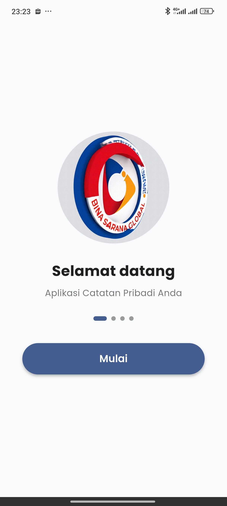
  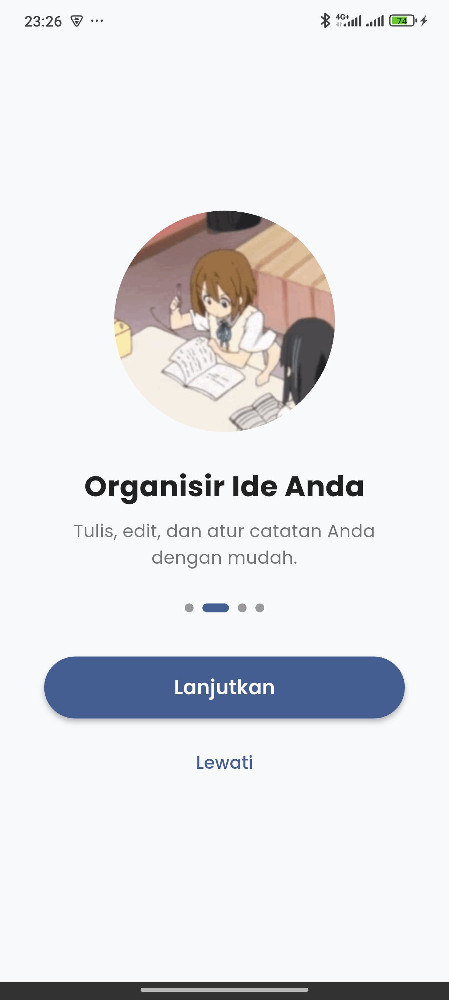
  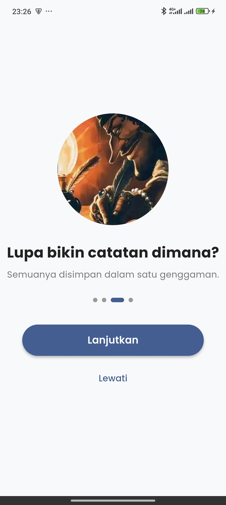
  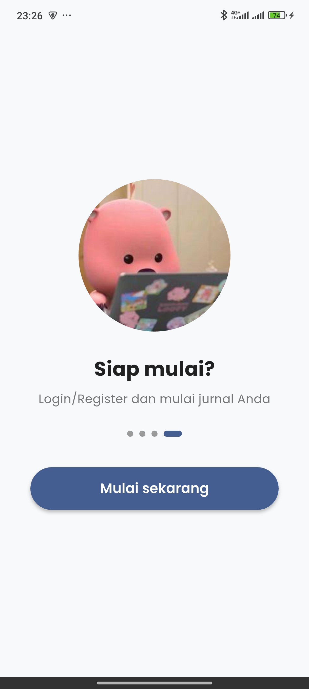
  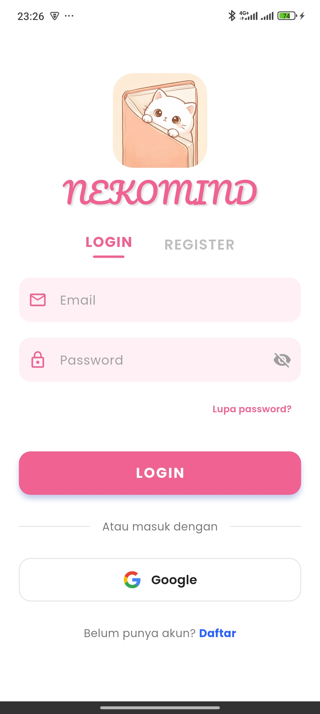
  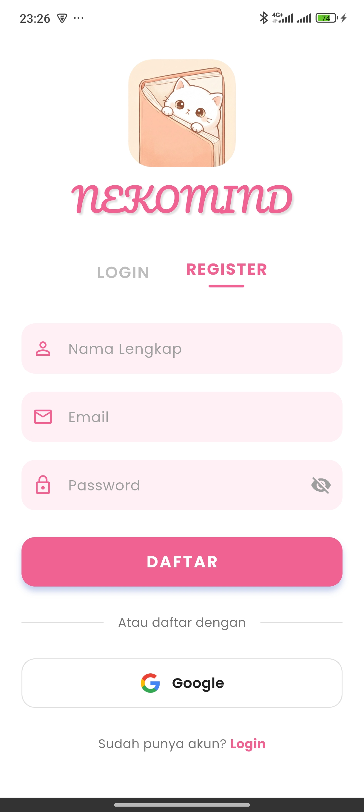
</div>


### Screenshots dari tampilan utama aplikasi

<div align="center">
  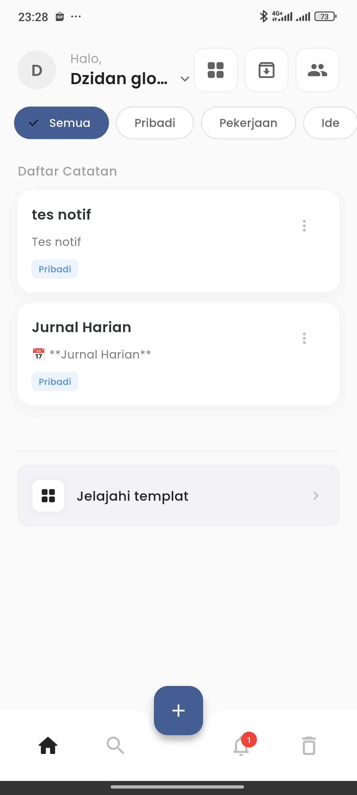
  
  
  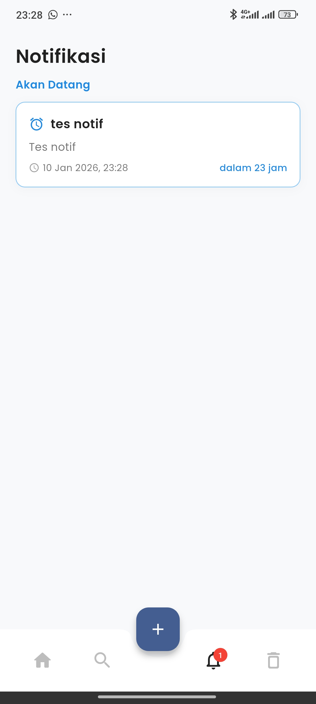
  
  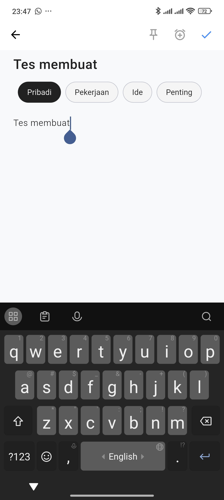
</div>

### Screenshots team developer

<div align="center">
  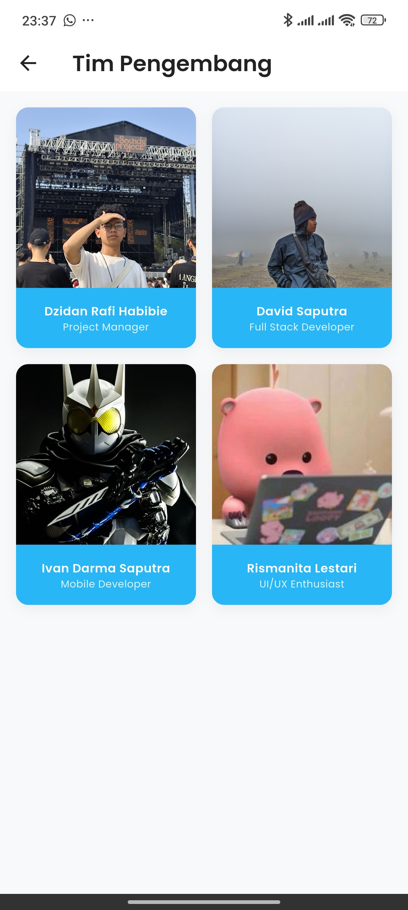
</div>
<div align="center">
  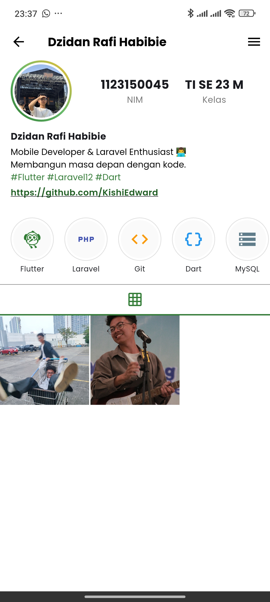
  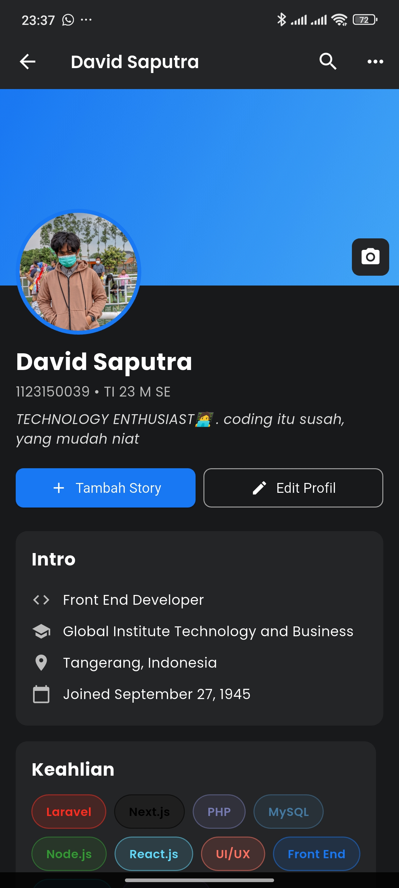
  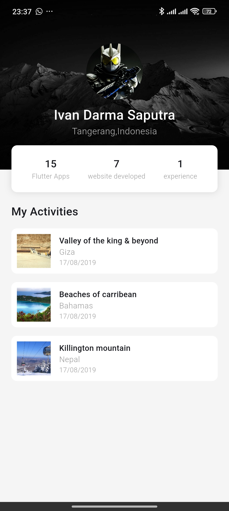
  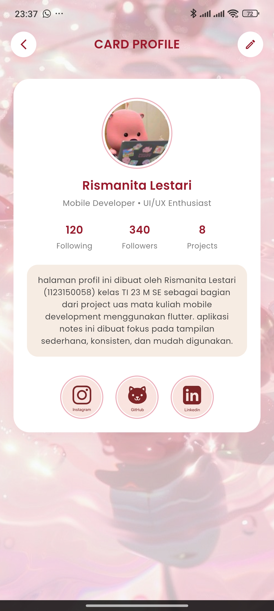
</div>

## Demo Video

Lihat video demo aplikasi kami untuk melihat semua fitur dalam aksi!

**[Watch Full Demo on YouTube](https://youtube.com/watch?v=dQw4w9WgXcQ)**

Alternative link: **[Google Drive Demo](https://drive.google.com/file/d/1234567890/view)**

## Download APK

Download versi terbaru aplikasi Nekomind:

### Latest Release v1.0.0
- [**Download APK (85.5 MB)**](https://github.com/KishiEdward/Notes_App_UAS/releases/download/v1.0.0/app-release.apk)


**Minimum Requirements:**
- Android 6.0 (API level 23) or higher
- ~100MB free storage space

## Built With

- **[Flutter](https://flutter.dev/)** - UI Framework
- **[Dart](https://dart.dev/)** - Programming Language
- **[Firebase Auth](https://firebase.google.com/products/auth)** - Google Sign-In & Authentication
- **[Firebase Firestore](https://firebase.google.com/products/firestore)** - Cloud Database
- **[Provider](https://pub.dev/packages/provider)** - State Management


## Getting Started

### Prerequisites

Pastikan Anda sudah menginstall:
- Flutter SDK (3.16.0 or higher)
- Dart SDK (3.2.0 or higher)
- Android Studio / VS Code
- Git

### Installation

1. Clone repository
```bash
git clone https://github.com/KishiEdward/Notes_App_UAS.git
```

2. Install dependencies
```bash
flutter pub get
```

3. Setup Firebase
```bash
# Download google-services.json dari Firebase Console
# Place in android/app/
cp path/to/google-services.json android/app/
```

4. Run aplikasi
```bash
flutter run
```

### Build APK

```bash
# Debug APK
flutter build apk --debug

# Release APK
flutter build apk --release

# Split APK by ABI
flutter build apk --split-per-abi
```

## 📁 Project Structure

```
lib/
├── firebase_options.dart     # Firebase configuration
├── main.dart                 # Entry point
├── models/                   # Data models
│   ├── note_model.dart
│   └── template_model.dart
├── pages/                    # UI Pages (Screens)
│   ├── archive_page.dart
│   ├── david_profile_page.dart
│   ├── dzidan_profile_page.dart
│   ├── forgot_password-e.dart
│   ├── help_page.dart
│   ├── home_page.dart
│   ├── ivan_profile_page.dart
│   ├── login_page.dart
│   ├── nita_profile_page.dart
│   ├── note_editor_page.dart
│   ├── notification_page.dart
│   ├── notification_settings_page.dart
│   ├── onboarding_page.dart
│   ├── profile_edit_page.dart
│   ├── profile_page.dart
│   ├── profile_team_page.dart
│   ├── register_page.dart
│   ├── search_page.dart
│   ├── settings_page.dart
│   ├── template_page.dart
│   ├── trash_note_view_page.dart
│   └── trash_page.dart
├── services/                 # Business Logic & API Calls
│   ├── auth_service.dart
│   ├── firestore_service.dart
│   ├── fcm_service.dart
│   ├── notification_service.dart
│   ├── session_manager.dart
│   ├── settings_service.dart
│   └── streak_service.dart
├── splash/                   # Splash Screen Logic
│   ├── splash_lottie.dart
│   ├── toggle_theme.dart
│   └── splash[1-4].dart
├── utils/                    # Utilities & Helpers
│   ├── fcm_background_handler.dart
│   ├── markdown_helper.dart
│   └── notification_helper.dart
└── widgets/                  # Reusable Widgets
```

## Authentication Flow

1. Splash Screen (Auto-login check)
   ↓
2. Login with Google (Firebase Auth)
   ↓
3. Home Screen (Dashboard with Cloud Sync)
   ↓
4. Profile & Settings

## 🗄️ Database Schema

### Notes Collection
```JSON
{
  "id": "string (UUID)",
  "user_id": "string (auth_uid)",
  "title": "string",
  "content": "string",
  "category_id": "string",
  "is_pinned": "boolean",
  "is_deleted": "boolean (for trash)",
  "deleted_at": "timestamp",
  "created_at": "timestamp",
  "updated_at": "timestamp"
}
```
### Archive categories
```JSON
{
  "id": "string",
  "user_id": "string",
  "category_name": "string",
  "color": "string (hex)"
}
```


## 📝 API & Services Integration

### Firebase Authentication
- Google Sign-In: Menggunakan firebase_auth dan auth_service.dart.
- Session Manager: Mengelola sesi pengguna secara lokal.

### Firebase Database
- CRUD Operations: Mengakses notes dan archive_categories melalui firestore_service.dart.

### Notifications
- FCM Service: Menangani push notification dari Firebase Cloud Messaging.
- Local Notification: Reminder jadwal melalui notification_service.dart.

### Development Workflow

1. Fork repository
2. Create feature branch (`git checkout -b feature/NewFeature`)
3. Commit changes (`git commit -m 'Add some NewFeature'`)
4. Push to branch (`git push origin feature/NewFeature`)
5. Open Pull Request

## Team Members & Contributions

### Development Team

| Name | Role | Contributions |
|------|------|---------------|
| **Dzidan Rafi Habibie** | Project Manager | - Project Coordination<br>- Fullstack Development<br>- App Integration & Testing<br>- Quality Assurance<br>- Documentation & Assets |
| **Ivan Darma Saputra** | Mobile Developer | - UI/UX Implementation<br>- Feature Development<br>- App Integration & Testing |
| **David Saputra** | Mobile Developer | - UI/UX Implementation<br>- Feature Development<br>- Core System Architecture |
| **Rismanita Lestari** | Mobile Developer | - UI/UX Implementation<br>- Feature Development |


## 📄 License

This project is licensed under the MIT License - see the [LICENSE](LICENSE) file for details.


## Acknowledgments

- [Flutter Community](https://flutter.dev/community) - For amazing packages
- [Firebase](https://firebase.google.com/) - For backend services
- [Flaticon](https://www.flaticon.com/) - For app icons
- [Unsplash](https://unsplash.com/) - For placeholder images


---

<div align="center">
  <p>Made with love of the Team</p>
  <p>© 2026 Nekomind. All rights reserved.</p>
</div>